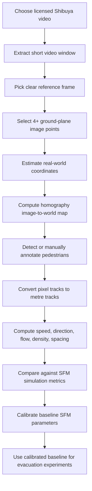

# Shibuya Calibration Process Flow

This document follows up the Shibuya calibration notebook without changing the notebook itself. It is intended as a supervisor-facing process plan for using Shibuya Crossing footage to calibrate a baseline pedestrian movement model before applying emergency evacuation assumptions.

## 1. Purpose

The Shibuya calibration work is not meant to model an emergency directly. It is a validation step for normal dense-crowd movement.

The purpose is to extract real pedestrian movement measurements from video, then use those measurements to calibrate the baseline Social Force Model (SFM). After the baseline is calibrated, emergency assumptions such as panic speed, blocked exits, crowd grouping, and route choice can be layered on top more defensibly.

## 2. Recommended Video Choice

| Video | Strength | Weakness | Recommendation |
|---|---|---|---|
| Shibuya Crossing, Tokyo, Japan (video).webm, 2019 | High resolution, 1920 x 1080, 59 s, clear dense crowd movement | Larger file, more expensive to process | Best primary video. Use a 10 to 15 second clip and optionally downscale to 720p for efficiency. |
| Shibuya Scramble Crossing.ogv, 2009 | Smaller file, useful second sample | Lower resolution, poorer tracking quality | Use only as robustness check after the 2019 video works. |
| Live streams or YouTube clips | More data, possibly current | Licensing and reproducibility issues | Avoid for the first calibration unless permission/licence is clear. |

Best practical choice: use the 2019 Wikimedia video, but only analyse a short 10 to 15 second window at 2 to 5 frames per second. This balances efficiency with crowd realism.

## 3. Overall Process Flow

## 4. Homography / Scale Calibration

Homography is the step that converts image coordinates in pixels into real-world ground-plane coordinates in metres.

This only works if the selected points lie on the same physical plane. For Shibuya, this means the road/crosswalk surface. Do not use building corners, signboards, traffic lights, elevated structures, or kerb points that are not on the road plane.

### Required Inputs

| Input | Meaning | Example |
|---|---|---|
| `image_points_px` | Pixel coordinates selected from the video frame | `[[x1, y1], [x2, y2], [x3, y3], [x4, y4]]` |
| `world_points_m` | Corresponding road-plane coordinates in metres | `[[0, 0], [12, 0], [12, 8], [0, 8]]` |

At least four point pairs are required. More than four is better because it allows the homography estimate to be more stable.

### Good Point Choices

Use points that are:

- clearly visible in the selected video frame,
- fixed on the road surface,
- far apart from one another,
- not blocked by pedestrians,
- preferably corners/intersections of crosswalk stripes or lane markings.

Good examples:

- four corners of one zebra-crossing rectangle,
- intersections between crosswalk stripe edges and road markings,
- corners of a visible road-plane polygon from aerial imagery,
- points along the same flat crossing area.

Bad examples:

- shop signs,
- building edges,
- lamp posts,
- people,
- traffic lights,
- top of kerbs if the ground height changes,
- any point not lying on the crossing road plane.

## 5. Obtaining Shibuya Crossing Dimensions

Public sources confirm that Shibuya Crossing is a very high-volume scramble crossing, but exact survey-grade dimensions are not easily available from general web pages. For example, Wikimedia describes the 2019 video as showing the scramble crossing in front of Shibuya Station's Hachiko exit, with peak flows of up to around 3,000 pedestrians at once. Guinness World Records also lists Shibuya Crossing as the busiest pedestrian crossing and reports very high hourly pedestrian volumes.

For calibration, we should avoid inventing precise dimensions. Use one of these defensible methods instead.

### Option A: Use Map or Aerial Measurement

Use OpenStreetMap, GIS software, or an aerial image to estimate real-world distances between visible road-plane points.

Suggested workflow:

1. Open Shibuya Crossing in OpenStreetMap, QGIS, Google Earth, or another measurement tool.
2. Identify the same road/crosswalk corners visible in the video frame.
3. Measure distances between those points in metres.
4. Build a local coordinate system, e.g. lower-left road point is `(0, 0)`.
5. Save the measured points and assumptions in a table.

This is suitable for pilot calibration, but the final report should state that dimensions are estimated from map/aerial reference.

### Option B: Use Aerial Reference Image

The Wikimedia aerial image of Shibuya Crossing can help identify road geometry and crossing layout. It is not enough by itself unless we can attach measured real-world coordinates to the selected points.

Use the aerial image to choose points, then use a map measurement tool to obtain distances.

### Option C: Ask Permanent Staff / Domain Expert

If the map/aerial estimate is unclear, ask permanent staff to confirm approximate road/crosswalk dimensions or provide a trusted base map.

This should be the preferred route if the calibrated speed values look unrealistic, because a small geometry error can cause a large speed error.

## 6. Computer Vision Options

There are three possible levels of computer vision complexity.

| Level | Method | Pros | Cons | Recommended use |
|---|---|---|---|---|
| 1 | Manual annotation using selected frames | Most explainable, fastest to debug, good for supervisor proof-of-concept | Small sample size, manual effort | Best immediate pilot. Annotate 20 to 50 pedestrians. |
| 2 | Detector + tracker, e.g. YOLO + ByteTrack / DeepSORT | Produces many trajectories, scalable | Requires dependency setup, can fail with occlusion | Use after manual pipeline works. |
| 3 | Optical flow / dense crowd motion | Captures crowd field without identifying every person | Harder to map to individual SFM agents | Useful as supporting analysis, not first choice. |

Recommended approach: start with manual annotation, then move to YOLO + ByteTrack only after homography and metric calculations are working.

## 7. What To Extract For SFM

For SFM calibration, the key quantities are distances, directions, and movement rates.

| Extracted quantity | How to compute | SFM relevance |
|---|---|---|
| Position in metres | Homography maps `(x_px, y_px)` to `(x_m, y_m)` | Required for all downstream metrics. |
| Walking speed | Distance travelled divided by time | Calibrates desired speed distribution. |
| Direction angle | `atan2(dy, dx)` | Calibrates movement direction groups. |
| Pairwise distance | Distance between each pair of pedestrians at same time | Calibrates social repulsion / personal space. |
| Nearest-neighbour distance | Minimum pairwise distance for each pedestrian | Checks crowd compactness. |
| Flow rate | Count crossings over a virtual line per second | Validates throughput. |
| Local density | Number of pedestrians per square metre | Validates crowd concentration. |

Avoid using video to infer sensitive or unreliable attributes such as gender. If heterogeneous agents are needed, use movement-based categories such as slow/medium/fast walkers, direction groups, and group membership.

## 8. Calibration Targets

The calibrated SFM should reproduce the observed Shibuya metrics within a reasonable range.

Suggested first targets:

| Target | Expected output |
|---|---|
| Speed distribution | Mean, standard deviation, 10th/50th/90th percentile speeds. |
| Direction groups | Distribution of movement angles. |
| Flow | Pedestrians per second across a selected line. |
| Spacing | Mean nearest-neighbour distance. |
| Density | Pedestrians per square metre in selected region. |

If the model reproduces speed but not spacing, social force parameters may be wrong. If it reproduces spacing but not throughput, route choice or goal placement may be wrong.

## 9. Debug Checklist

| Problem | Likely cause | Fix |
|---|---|---|
| Speeds are unrealistically high | Homography scale is wrong, points are not on same plane, frame rate incorrect | Recheck world-point distances, ensure all points lie on road plane, verify FPS. |
| Speeds are near zero | Same pedestrian not tracked across frames, timestamps wrong | Check `ped_id` consistency and frame/time conversion. |
| Pedestrian paths curve strangely after conversion | Bad homography point ordering or non-road-plane points | Reorder image/world points consistently and avoid elevated/non-road points. |
| Tracking loses people | Occlusion, low resolution, detector threshold too strict | Use manual annotation for pilot or shorten clip. |
| Too slow to process | Video too large, too many frames | Downscale to 720p, sample at 2 to 5 FPS, use 10 to 15 seconds only. |
| Simulated crowd too spread out | Social repulsion too strong or agent radius too large | Lower social force factor or radius. |
| Simulated crowd too compressed | Social repulsion too weak or desired speed too high | Increase social force factor or reduce desired speed. |
| Flow mismatch | Measurement line or goal locations do not match video | Recheck flow line placement and pedestrian direction grouping. |

## 10. Minimal Pilot Plan For This Week

If time is limited, do this only:

1. Use the 2019 Wikimedia video.
2. Extract a 10 second clip.
3. Select one clear reference frame.
4. Choose at least four road-plane points.
5. Estimate dimensions using map/aerial measurement.
6. Manually annotate 20 pedestrians across 5 to 10 frames each.
7. Compute speed distribution and direction angles.
8. Report this as an initial calibration pipeline, not a final calibrated model.

This is enough to show that the FYP is moving from arbitrary parameters toward real-video-informed calibration.

## 11. Supervisor Explanation

A concise way to explain this:

> I am using Shibuya Crossing as a non-emergency dense-crowd calibration case. The video is not used to model panic directly. Instead, it helps estimate baseline pedestrian movement: speed distributions, direction groups, density, flow, and spacing. The key technical step is homography, where four or more points on the road plane are mapped from image pixels to real-world metres. Once the baseline SFM reproduces these real-world movement metrics, emergency assumptions such as panic speed and blocked exits can be introduced separately.

## 12. Sources

- Wikimedia Commons, `Shibuya Crossing, Tokyo, Japan (video).webm`: https://commons.wikimedia.org/wiki/File:Shibuya_Crossing,_Tokyo,_Japan_(video).webm
- Wikimedia Commons, `Shibuya Scramble Crossing.ogv`: https://commons.wikimedia.org/wiki/File:Shibuya_Scramble_Crossing.ogv
- Wikimedia Commons, `Shibuya Crossing, Aerial.jpg`: https://commons.wikimedia.org/wiki/File:Shibuya_Crossing,_Aerial.jpg
- Guinness World Records, `Busiest pedestrian crossing`: https://www.guinnessworldrecords.com/world-records/448095-busiest-pedestrian-crossing
- Wikipedia, `Shibuya Crossing`: https://en.wikipedia.org/wiki/Shibuya_Crossing
